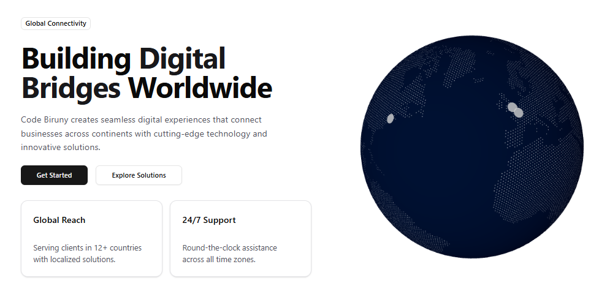

## Code Biruny - Building Digital Bridges Worldwide

### About Us
- Code Biruny is a globally recognized technology company committed to delivering seamless digital experiences. We specialize in connecting businesses across continents through innovative and cutting-edge technological solutions, fostering global connectivity.

### Company Overview
- **Mission:** To empower businesses worldwide with advanced digital infrastructure.
- **Vision:** To lead as the premier global provider of innovative digital solutions.
- **Established:** 2025
- **Headquarters:** Global Operations Hub

### Technology Stack
Our expertise spans a wide array of modern technologies and tools to ensure robust, scalable, and efficient solutions.

  <!-- Core Technologies -->
  
  
  
  
  
  
  
  
  
  
  
  
  
  
  
  

  <!-- UI Frameworks & Extras (use placeholder logos or brand assets from their GitHub pages if not on Simple Icons) -->
  
  
  
  
  
  

